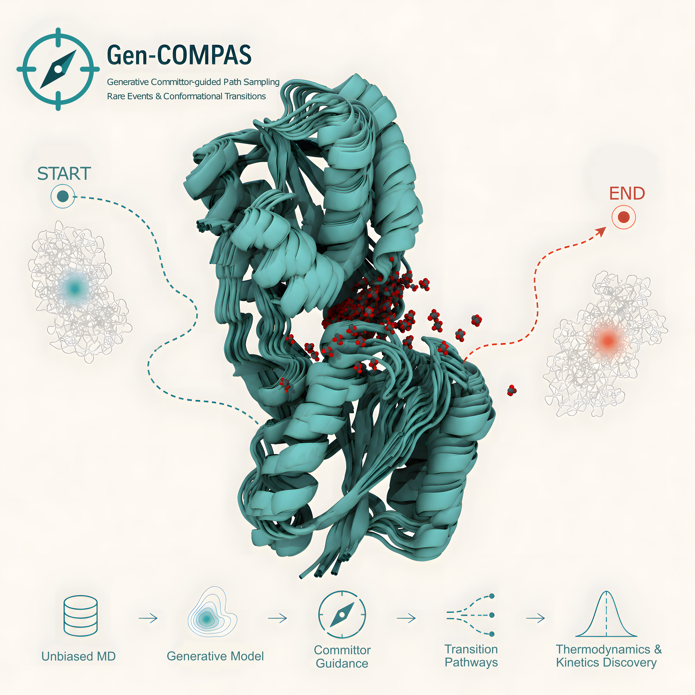

<!DOCTYPE html>
<html lang="en">

<h1>Gen-COMPAS: Generative committor-guided path sampling for rare events </h1>

This repository provides a modular pipeline for protein structure generation, committor analysis, clustering, and trajectory reweighting.
It combines <strong>diffusion models</strong> for structure generation with <strong>Variational Committor Networks (VCN)</strong> for reaction coordinate learning, along with postprocessing tools for clustering, occupancy analysis, and trajectory reweighting.

For computing statistical weights and estimating free energy landscapes, please refer to the <strong>Riteweight</strong> method described in: <a href="https://arxiv.org/html/2401.05597v1">https://arxiv.org/html/2401.05597v1</a>.

The RiteWeight implementation and its downstream weighted FEL projection are available through <code>run.py</code>.

<h2>Overview</h2>

<ul>
<li>The main entry point is a single Python script that dispatches different stages of the workflow based on a YAML configuration file.</li>
<li>You can train models, perform inference, analyze trajectories, and perform reweighting with a unified interface.</li>
</ul>

<h2>Workflow Steps</h2>

<table>
<thead>
<tr>
<th>Step Name</th>
<th>Function</th>
<th>Description</th>
</tr>
</thead>
<tbody>
<tr>
<td><code>train_diffusion</code></td>
<td><code>train_diffusion_model()</code></td>
<td>Train a diffusion model for protein structure generation.</td>
</tr>
<tr>
<td><code>sample_diffusion</code></td>
<td><code>run_diffusion_inference()</code></td>
<td>Generate new protein conformations using a trained diffusion model.</td>
</tr>
<tr>
<td><code>train_committor</code></td>
<td><code>train_committor_model()</code></td>
<td>Train a Variational Committor Network (VCN) to predict committor probabilities from MD data.</td>
</tr>
<tr>
<td><code>committor_analysis</code></td>
<td><code>run_committor_analysis()</code></td>
<td>Perform committor-based slicing and analysis on generated structures.</td>
</tr>
<tr>
<td><code>clustering</code></td>
<td><code>run_clustering()</code></td>
<td>Cluster conformations using k-means and extract representative structures.</td>
</tr>
<tr>
<td><code>occupancy</code></td>
<td><code>add_occupancy()</code></td>
<td>Add hydrogen atoms and set occupancy flags in PDB files for visualization or targeted MD.</td>
</tr>
<tr>
<td><code>riteweight</code></td>
<td><code>run_riteweight()</code></td>
<td>Compute trajectory weights and emit aligned VCN and diffusion training data.</td>
</tr>
<tr>
<td><code>fel_estimate</code></td>
<td><code>run_fel_estimate()</code></td>
<td>Project RiteWeight results into weighted 1D or 2D free-energy landscapes.</td>
</tr>
</tbody>
</table>

<h2>Usage</h2>

<h3>Run a Specific Step</h3>

<pre><code>python run.py --step &lt;STEP_NAME&gt; --config &lt;PATH_TO_CONFIG&gt;
</code></pre>

RiteWeight and FEL projection use the corresponding sections in the unified <code>config.yaml</code>:

<pre><code>python run.py --step riteweight --config config.yaml
python run.py --step fel_estimate --config config.yaml
</code></pre>

<strong>Available <code>&lt;STEP_NAME&gt;</code> options:</strong>

<ul>
<li><code>train_diffusion</code></li>
<li><code>sample_diffusion</code></li>
<li><code>train_committor</code></li>
<li><code>committor_analysis</code></li>
<li><code>clustering</code></li>
<li><code>occupancy</code></li>
<li><code>riteweight</code></li>
<li><code>fel_estimate</code></li>
</ul>

<h2>Configuration File (config.yaml)</h2>

All parameters for model training, inference, and analysis are specified in a single YAML file.
Below is a summary of each section.

<h3>1. Generative Model (Generative)</h3>

Train or sample from a diffusion model that learns to generate protein structures.

<strong>Key subsections:</strong>

<ul>
<li><strong>data:</strong> Input trajectory and topology paths.</li>
<li><strong>model:</strong> Embedding and architecture parameters (SchNet and attention layers).</li>
<li><strong>diffusion:</strong> Diffusion model hyperparameters (timesteps, beta schedule).</li>
<li><strong>training:</strong> Optimization and logging parameters.</li>
<li><strong>inference:</strong> Sampling configuration (checkpoint, output, batch size, etc.).</li>
</ul>

<h3>2. Variational Committor Network (VCN)</h3>

Train and evaluate a committor model to predict transition probabilities between states A and B.

<strong>Key fields:</strong>

<ul>
<li><strong>Sampling_path, topfile, atomselect:</strong> Input trajectory data.</li>
<li><strong>epochs, learning_rate, num_layers, num_nodes:</strong> Training hyperparameters.</li>
<li><strong>gendcdfile, model_fn, slice_dir:</strong> For slicing generated trajectories by committor values.</li>
<li><strong>cvs_to_plot:</strong> For visualization (2D or 3D plots).</li>
</ul>

<h3>3. Clustering (Clustering)</h3>

Cluster conformations based on atomic coordinates and extract representative structures.

<strong>Parameters include:</strong>

<ul>
<li><strong>n_clusters:</strong> Number of clusters (or auto-detected if null).</li>
<li><strong>n_per_cluster:</strong> Frames per cluster to output.</li>
<li><strong>select_farthest:</strong> Include both closest and farthest structures from centroids.</li>
</ul>

<h3>4. Occupancy (Occupancy)</h3>

Set atom occupancies or add hydrogens in PDB files.

<strong>Parameters include:</strong>

<ul>
<li><strong>pdb_dir, topology_file, pdb_file:</strong> Input files and directories.</li>
<li><strong>add_hydrogens:</strong> Whether to add hydrogens. <em>(Notice: Only for formatting, do NOT use hydrogens for TMD simulations)</em></li>
<li><strong>selection:</strong> MDTraj/MDAnalysis selection string for occupancy.</li>
</ul>

<h3>5. RiteWeight (RiteWeight)</h3>

Compute statistical weights and aligned training artifacts using the
<strong>RiteWeight</strong> method described in the paper linked above.

<strong>Key options:</strong>

<ul>
<li><strong>io:</strong> Topology, output directory, and trajectory stride.</li>
<li><strong>features:</strong> Distance or internal-Z-matrix features, with optional caching.</li>
<li><strong>riteweight:</strong> Cluster count, lag, iteration, convergence, and random-seed controls.</li>
<li><strong>colvars:</strong> CV retention and optional periodic encodings.</li>
<li><strong>outputs:</strong> Torch VCN table and selected DCD/PDB files for diffusion training.</li>
</ul>

<h3>6. Weighted FEL Projection (FEL_estimate)</h3>

Build one or more weighted 1D/2D free-energy projections directly from the RiteWeight Torch or CSV table.

<h2>Practical Guidance for Parameter Tuning</h2>

The hyperparameters provided in the configuration file and manuscript should be treated as empirically validated settings for the systems studied here, rather than universal constants. In practice, most machine-learning hyperparameters were not tuned separately for each system. For the complex systems considered in this work, we used the same generative-model architecture, optimizer settings, training protocol, and diffusion-related hyperparameters across applications. The batch size was adjusted only when required by GPU memory limitations. The exact values used for each application are reported in the corresponding configuration files and in the manuscript.

For the Variational Committor Network (VCN), the lag time <code>tau</code> is only weakly sensitive within a broad physically meaningful range. Training is mainly affected when <code>tau</code> is chosen at pathological limits. If <code>tau</code> is too short, for example on the order of approximately 1 fs, the data may retain non-Markovian vibrational correlations. If <code>tau</code> is too long, for example on the order of approximately 1 ns, transition-region correlations may be largely lost and the training statistics can deteriorate. Between these limits, the learned committor is only weakly affected by the precise choice of <code>tau</code>. The values used in the present applications are provided in the example configuration files and in the manuscript.

The parameters that require the most practical attention are the targeted molecular dynamics (TMD) force constant and the noise level used during generative sampling. The TMD force constant should be large enough to reduce the RMSD to the generated target over the chosen TMD duration, but not so large that it produces abrupt structural distortions or unstable forces. We recommend choosing this parameter by inspecting the initial and final RMSD distributions, especially the first and final 2% of each TMD trajectory. A useful setting should produce a clear decrease in the final RMSD while maintaining structurally plausible trajectories.

For generative sampling, we recommend noise values in the approximate range <code>0</code>–<code>50</code>. Larger values can be useful during the initial iterations, especially when the available trajectories are short or sparse, because they increase the diversity of generated intermediates and help initialize subsequent sampling. After additional transition data have been accumulated, smaller values, typically <code>0</code>–<code>2</code>, are usually sufficient.

Increasing the sampling noise moves generated structures farther from the current data distribution and improves diversity, whereas decreasing the noise keeps generated structures closer to previously sampled configurations but reduces exploration. In all cases, the final acceptance criterion should not be the generative loss alone, but the downstream molecular dynamics diagnostics, including TMD convergence, bidirectional committor consistency, shooting validation where feasible, and reproducibility across independent Gen-COMPAS runs.

<h2>Dependencies</h2>

<strong>Core requirements:</strong>

<ul>
<li>Python &gt;= 3.9</li>
<li>PyTorch &gt;= 2.0</li>
<li>MDTraj, MDAnalysis</li>
<li>NumPy, SciPy, scikit-learn, pandas, matplotlib</li>
<li>PyYAML, tqdm, kneed, tensorboard</li>
</ul>

<h2>Installation</h2>

We recommend creating a fresh conda environment first so the Python version is explicit and reproducible. The package currently builds cleanly with <strong>Python 3.12.4</strong> in this repository, while the package metadata allows <strong>Python &gt;= 3.9</strong>.

To avoid the runtime import issues seen with <code>MDAnalysis</code> on some systems, create the environment from <strong>conda-forge</strong> and install the C++ runtime libraries up front:

<pre><code>conda create -n gen-compas -c conda-forge python=3.12.4 libstdcxx-ng libgcc-ng -y
conda activate gen-compas
</code></pre>

Then clone the repository and install it with pip:

<pre><code>git clone https://github.com/Tangcyu/Gen-COMPAS.git
cd Gen-COMPAS
pip install .
</code></pre>

<strong>Note:</strong> Gen-COMPAS no longer requires <code>torch-scatter</code>. The package uses native PyTorch operations for the scatter-mean steps, which avoids binary compatibility issues with different PyTorch builds.

This installs the <code>gen-compas</code> command-line entry point, so the workflow can be launched with:

<pre><code>gen-compas --step &lt;STEP_NAME&gt; --config &lt;PATH_TO_CONFIG&gt;
</code></pre>

If you want to verify the environment before running a workflow, the following checks should succeed without import errors:

<pre><code>python -c "import MDAnalysis; print('MDAnalysis import ok')"
python -c "import run; print('run import ok')"
gen-compas --help
</code></pre>

If you already created the environment and encounter a <code>CXXABI</code> or <code>libstdc++.so.6</code> error, repair it with:

<pre><code>conda install -n gen-compas -c conda-forge libstdcxx-ng libgcc-ng -y
</code></pre>

You can also build and install the wheel manually if needed:

<pre><code>python -m pip wheel --no-deps . -w dist
pip install dist/gen_compas-0.1.0-py3-none-any.whl
</code></pre>

<h2>Demo</h2>

The initial training data for the Trp-cage fast-folding protein is located at:

<pre><code>example/0.DEMO_Trp-cage/Dataset/
</code></pre>

On an NVIDIA L40s GPU:

<ul>
<li>Training the diffusion model for 50 epochs takes approximately <strong>5 minutes</strong>, producing PyTorch checkpoints (.pt).</li>
<li>Generating 1,000 structures (.pdb format) using batch size 200 takes approximately <strong>1 minute</strong>.</li>
</ul>

<h2>Reproducibility</h2>

The <code>example/</code> folder contains all molecular dynamics input files used in the paper, prepared for the NAMD and Colvars software packages. These include:

<ul>
<li>Topologies, coordinates, velocities, and periodic boxes</li>
<li>Force field parameter files</li>
<li>Systems for NANMA, Tri-alanine, Trp-cage, RBP, and AAC</li>
</ul>

Running the complete Gen-COMPAS workflow on these inputs will reproduce the results presented in the manuscript.

</body>
</html>
